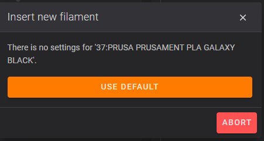
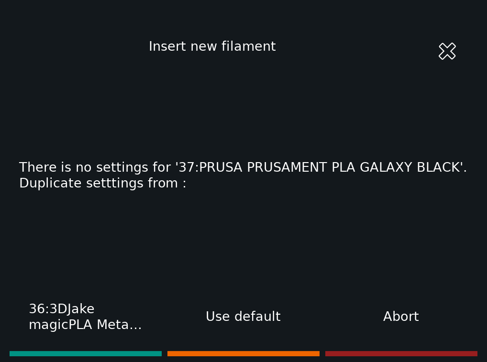
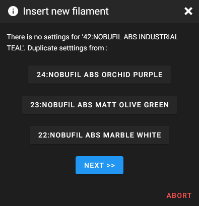

# KBobine 


>[!WARNING] 
**This repo is still at work, doc is uncomplete and code can present some
bugs, use it whith care**

Kbobine is a gateway between Spoolman and Klipper (via moonraker), it allows to send current spool
informations to Klipper. 
Then, it let you store settings inside Klipper
configuration and back it up to Spoolman.

**Compatibility: Fluidd/Klipperscreen/Mainsail UI.**

**Requirements: a working Spoolman component in Moonraker**

|  |  |  |
| ---------------------------- | ------------------------------------- | -------------------------------- |
| _Fluidd_                      | _KlipperScreen_                       | _Mainsail_                       |

### What it does ?
At Klipper startup or when a spool is selected (by UI or macro), it informs 
Klipper and send back informations from Spoolman to klipper (material, vendor,
name of the filament, ..., or stored settings from other printers).
Klipper apply settings previously set for this spool. If no information 
found, settings from equivalent spool/material/default ot other pinters can be imported.

> [!NOTE] 
> With the [minimal install](#run-the-installer) you can use kbobine just to share information between klipper and spoolman. [More informations on how ``spoolman_ext.py`` works](./spoolman_ext.md)

### What kind of settings ?
Pressure advance and firmware retraction was the first parameters introduced in 
early version. But you can store any settings you need in your Macros.
For example, I store temperatures, filter use, filament sensor use, extrude_factor...
I use some extended functions to limit max_flow and fan_speed during the print.
An experimental klippy module introduces shrinkage compensation at run time  


## How it works ?
KBobine uses a moonraker component ``spoolman_ext.py`` or ``kbobine.py`` to track spool change then send informations about spool to klipper.
It stores infos about spool in a json file once the spool is loaded. If no setting is detected, it will prompt to calibrate filament or load settings from other known filaments.
Then it populates a ``current_settings`` array from default settings and stored settings. This array can be called from your Macros like this:

```   ```

## How to install it ?

### Clone the repo
First clone the current repo on your printer
```
cd ~
git clone https://github.com/fbeauKmi/kbobine_filament_settings.git kbobine
cd kbobine
```

### Run the installer 
```
Usage: bash install.sh [-0|--option]

Kbobine installer

Optional args:
  -m, --minimal              Install moonraker component only.
  -f, --force                Force Moonraker component installation.
  -h, --help                 Display this help message and exit.
```

>[!WARNING]
>The script does not restart Klipper/Moonraker, you will have to do it manually once done. 
>```
>sudo systemctl restart klipper
>sudo systemctl restart moonraker
>```

### Create kbobine extra_fields in Spoolman

To share filament settings between different printers, add Extra Fields in Spoolman for both filaments and spools. Create a text field named "kbobine" to store saved parameters (temperatures, PA, retraction, etc.). Make sure these fields are enabled for both filament and spool entries so KBobine can read and write the data.

## Uninstall it
Remove Moonraker component, delete ``kbobine`` folder, Manually remove entries in ``moonraker.conf`` and klipper config
```
 unlink ~/moonraker/moonraker/components/spoolman_ext.py
 unlink ~/moonraker/moonraker/components/kbobine.py
 rm -rf ~/kbobine
 ```

## How to use it ?

- [Kbobine Configuration and usage](./kbobine_macros.md)
- [Simple Use case : Check in PRINT_START if a spool is selected](./spoolman_ext.md#simple-use-case-check-in-print_start-if-a-spool-is-selected)

## Acknowledgements
Thanks to French Voron Community for support and advices. 